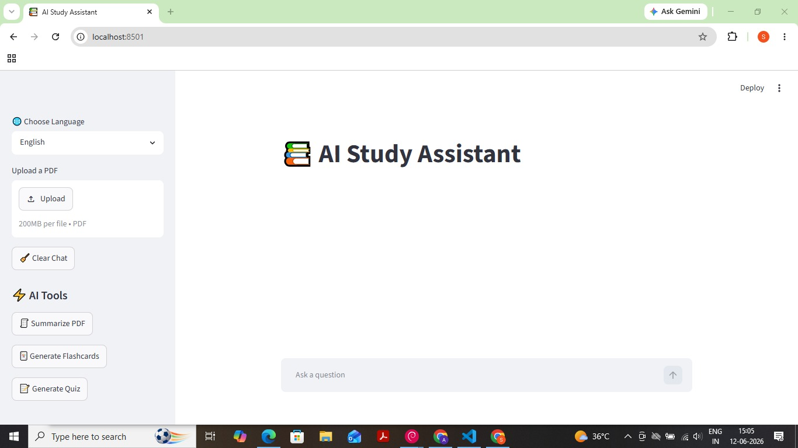

# 📚 AI Study Assistant

## Application Preview



An AI-powered Study Assistant built using Streamlit, Ollama, and LangChain.

## Features

- PDF Upload & Analysis
- AI Chat Assistant
- PDF Summarization
- Flashcard Generation
- Quiz Generation
- English, Hindi, Telugu Support
- Local AI using Ollama
- FAISS Vector Search

## Tech Stack

- Python
- Streamlit
- LangChain
- Ollama
- PyPDF2
- FAISS

## Run Locally

```bash
pip install -r requirements.txt
streamlit run app.py
```

## Project Structure

```text
ai-study-assistant/
│
├── app.py
├── llm.py
├── rag.py
├── utils.py
├── memory.py
├── summary.py
├── flashcards.py
├── quiz.py
├── vectorstore.py
├── requirements.txt
│
└── translations/
    ├── en.json
    ├── hi.json
    └── te.json
```

## Author

Akshitha Daroju
